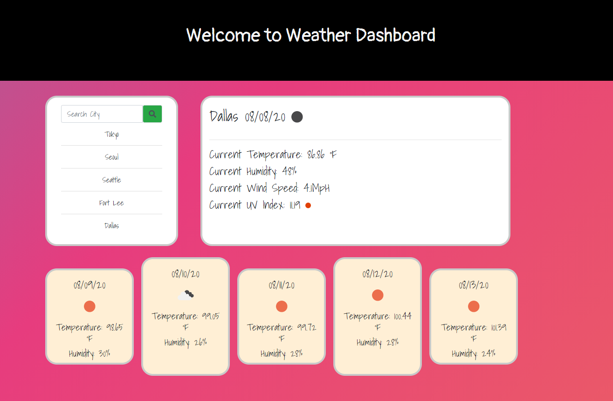

# Homework 5 - Weather Dashboard

## Built With (Used Languages)

* HTML5
* CSS3
* JavaScript
    * moment.js

## References
* [Markup Validation Service](https://validator.w3.org/) - to validate HTML page and correct errors in HTML page.
* [OpenWeather](https://openweathermap.org/api) - for API and documetations.
* [Bootstrap](https://getbootstrap.com/) - used for grids such as rows and columns.
* [Moment.js](https://momentjs.com/) - for current time and dates.
## Page Preview (Link)

https://misterjaykay.github.io/weather-dashboard

## Page Preview (Image) 

## Overview (Contents)

This is Homework 5 - Weather Dashboard.

In this activity, I created an app that displays the city weather that user searched.

When a user search for a city, It will display current citys weather information along with current date and city's temperature, humidity, wind speed, and UV index.

Also, It will display weather icon that is currently matches with current weather info and it will give you UV index color icon depends on how the UV index condition is.

This app will not just display today's weather, it will also give you 5-day forecast for a city user searched.

It also have a list of what user searched previously, and allowing users to browse those previous cities weather when those cities are clicked.

Because it has a ability save the users previous search history data to localstorage, whenever user refresh the page or re-open the page, previous search history will still be there.

## Contact

Jonghyun Kang - misterjaykay@gmail.com

Project Repo Link: https://github.com/misterjaykay/weather-dashboard